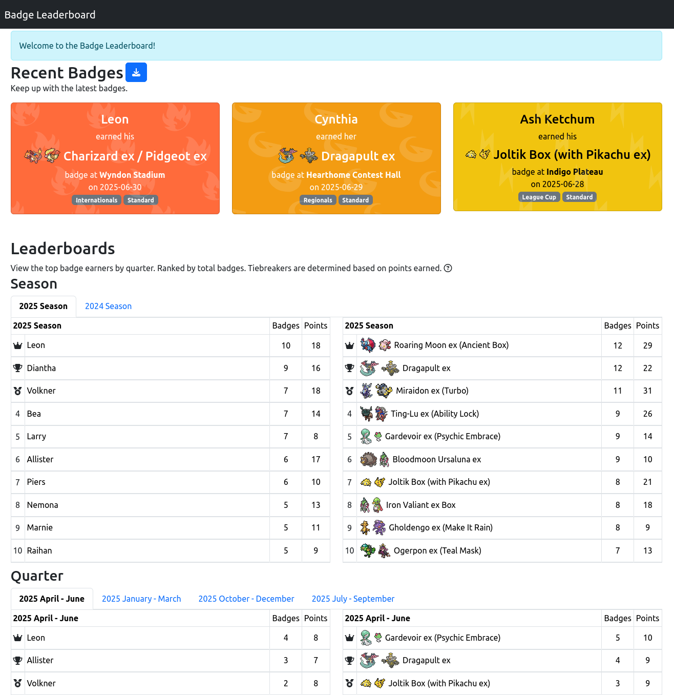
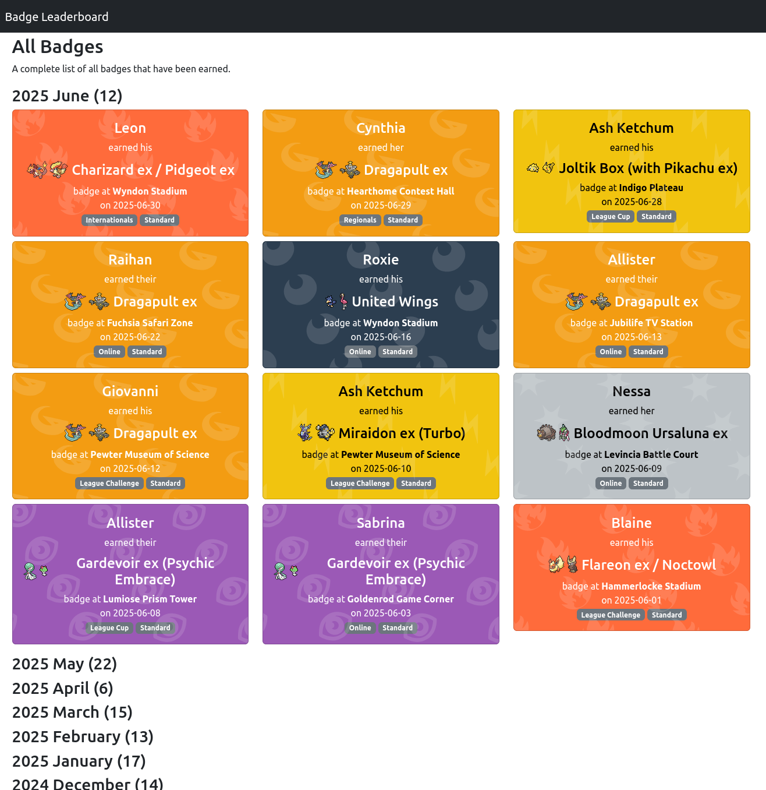

# Badge Leaderboard

A Dash-powered web application for tracking badges earned by players and displaying a public leaderboard.

## Features

- Public leaderboard with weighted and unweighted badge counts
- Badge gallery grouped by month
- Admin interface for adding new badges (authentication required)
- Data stored in newline-delimited JSON for easy editing

## Getting Started

### Prerequisites

- Python 3.10+
- [pip](https://pip.pypa.io/)

### Installation

```bash
pip install -r requirements.txt
```

### Running the App

```bash
python src/app.py
```

The application also provides a Docker setup:

```bash
docker compose up --build
```

### Authentication

Set the following environment variables to enable basic authentication for the admin interface:

- `TH_BL_USER` – username
- `TH_BL_PASSWORD_HASH` – password hash generated via PBKDF2 (use `hash_password` in `src/app.py` to generate)
- `TH_BL_FILE` – filename to use for badges, defaults to `example.jsonl`

## Screenshots (using fake data)





## TODO

- [ ] make different it game generic so other systems could configure a badge system by providing icons/backgorun icons/etc.
- [ ] clean up how data is read/written
- [ ] document deployment steps

## License

This project is licensed under the terms of the [MIT License](LICENSE).
