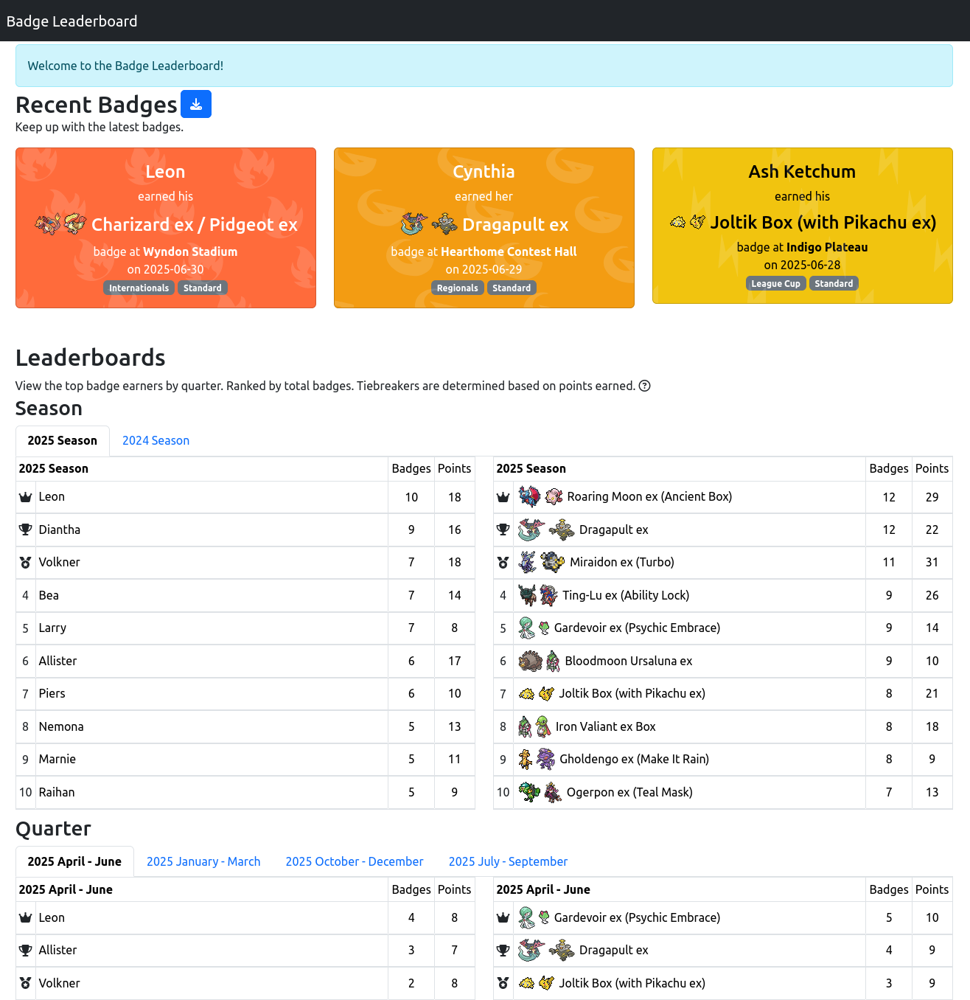
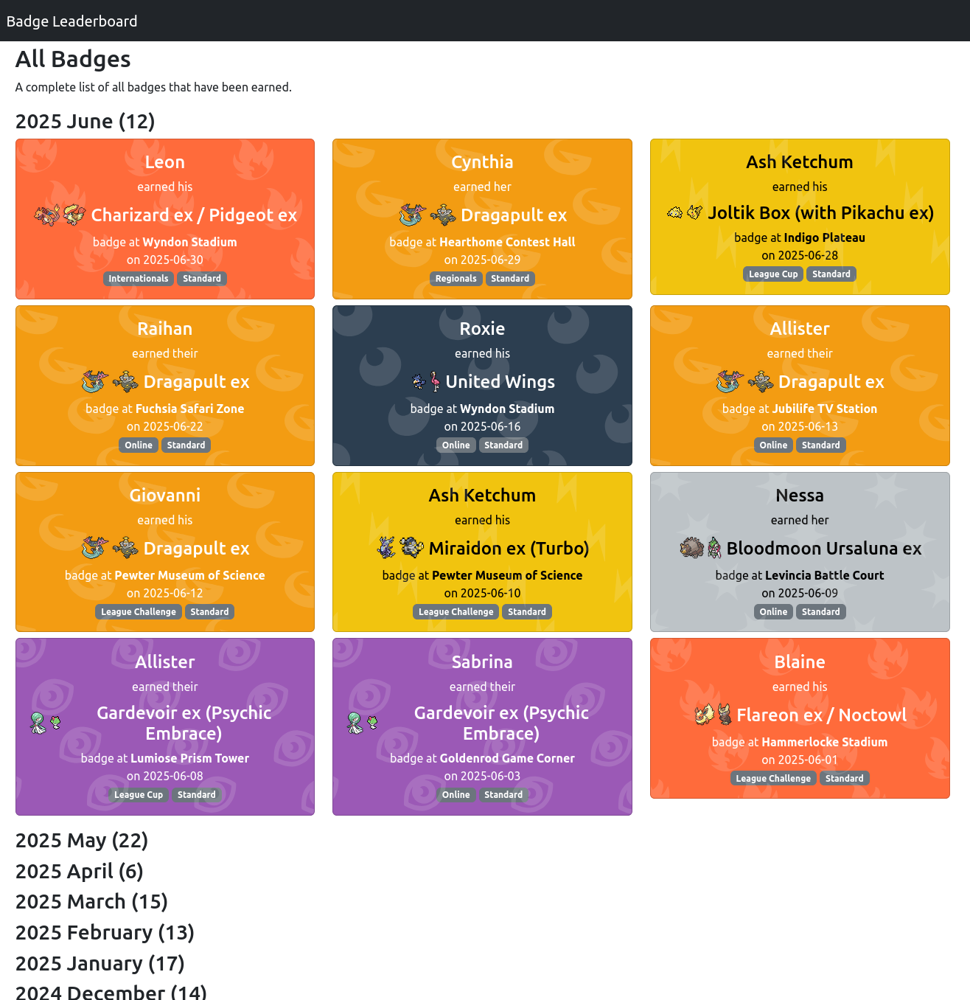

# Badge Leaderboard

A Dash-powered web application for tracking badges earned by players and displaying a public leaderboard.

## Features

- Public leaderboard with weighted and unweighted badge counts
- Badge gallery grouped by month
- Admin interface for adding new badges (authentication required)
- Data stored in newline-delimited JSON for easy editing

## Getting Started

### Prerequisites

- Python 3.10+
- [pip](https://pip.pypa.io/)

### Installation

```bash
pip install -r requirements.txt
```

### Running the App

```bash
python src/app.py
```

The application also provides a Docker setup:

```bash
docker compose up --build
```

`docker-compose.yml` bind-mounts a single `./data` directory into the container
(`TH_BL_DATA_DIR=/app/data`) and keeps all data files inside it. Individual
files are created by the app on demand, so nothing needs to be pre-created — an
empty `./data` directory is enough for a fresh deploy. Data files:

- `badges.jsonl` — 2026 (and earlier) badge seasons.
- `events_2027.jsonl` — 2027+ event seasons (one event per line, badges derived
  from standings).
- `discord_ids.json` — trainer → Discord ID map for pings.

Upgrading from an older deploy that bind-mounted these files individually at the
repo root? Move them into `./data/` once:

```bash
mkdir -p data && mv badges.jsonl discord_ids.json data/ 2>/dev/null || true
```

### Authentication

The admin interface uses HTTP Basic auth. Every configured account is an admin.
Accounts come from two sources (merged, so either works):

- `TH_BL_USERS` – a JSON object of `{"username": "<hash>"}`. Preferred; supports
  multiple accounts (we run fewer than ~5).
- `TH_BL_USER` + `TH_BL_PASSWORD_HASH` – the legacy single-account pair. Still
  supported and merged in alongside `TH_BL_USERS`.

Other env vars:

- `TH_BL_FILE` – default badge file, defaults to `example.jsonl`.

Password hashes are PBKDF2-SHA256. Generate one with:

```bash
PYTHONPATH=src python -m util.passwords 'the-password'
```

#### Adding a user (example: `monado`)

1. Generate a hash for their password:

   ```bash
   PYTHONPATH=src python -m util.passwords 'monados-password'
   # -> e.g. Q2hhbmdlTWUhU2FsdAAAAAAA...   (copy this)
   ```

2. Add them to `TH_BL_USERS` in your `.env` (the file `docker-compose.yml`
   loads). Add a comma-separated entry per user — keep it valid JSON on one line:

   ```dotenv
   TH_BL_USERS={"admin":"<admin-hash>","monado":"<monado-hash>"}
   ```

   Give your buddy their username (`monado`) and the plaintext password you hashed.

3. Restart so the new env is picked up:

   ```bash
   docker compose up -d
   ```

A single legacy account can still be set with `TH_BL_USER` / `TH_BL_PASSWORD_HASH`
instead of (or in addition to) `TH_BL_USERS`.

## Screenshots (using fake data)





## Exporting data to time series

`PYTHONPATH=src python -m util.export_time_series out.csv --cumulative`

## Exporting raw data (HTTP)

`GET /api/export-badges` streams a data file as newline-delimited JSON
(requires auth). By default it returns the badge file; select another season's
file by year or filename (both validated against the season config):

- `GET /api/export-badges` – default badge file (`badges.jsonl`)
- `GET /api/export-badges?season=2027` – that season's file (`events_2027.jsonl`)
- `GET /api/export-badges?file=events_2027.jsonl` – by exact filename

## TODO

- [ ] make different it game generic so other systems could configure a badge system by providing icons/backgorun icons/etc.
- [ ] clean up how data is read/written
- [ ] document deployment steps

## License

This project is licensed under the terms of the [MIT License](LICENSE).
